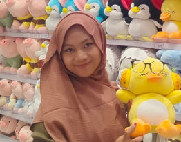

<!-- GitHub Profile README -->

<h1 align="center">✨ hi I'm Anisha Fadilla ✨</h1>

  

---

### 🌸 About Me
✨ I’m **Anisha Fadilla** (a.k.a. `nishajournaling`)  
💡 Passionate about journaling, designing, reading Islamic books, and helping my parents in business.  
🌱 My dream is to become a successful entrepreneur and build my own **Islamic book company**.  
💻 I enjoy learning **new things in IT** and love making friends along the way.  

---

### 🌱 Interests
- 📔 Journaling & Creative Writing  
- 🎨 Designing & Creativity  
- 📚 Reading Islamic Books (Kitab)  
- 🛍️ Trading & Supporting Family Business  
- 🚀 Building a future **Islamic publishing company**  
- 💻 Exploring IT and Digital World  

---

### 🌐 Connect with Me

  

---

### 📊 GitHub Stats

  
  

---

### 🔥 GitHub Streak

  

---

### 👀 Profile Visitors

  

---

### 🕋 Spiritual Vibes

  

